### Procedure: Determination of Flakiness Index of Coarse Aggregate

#### Step 1: Weighing of coarse aggregate sample

• Click on the tray to place the tray on the weighing balance.  
 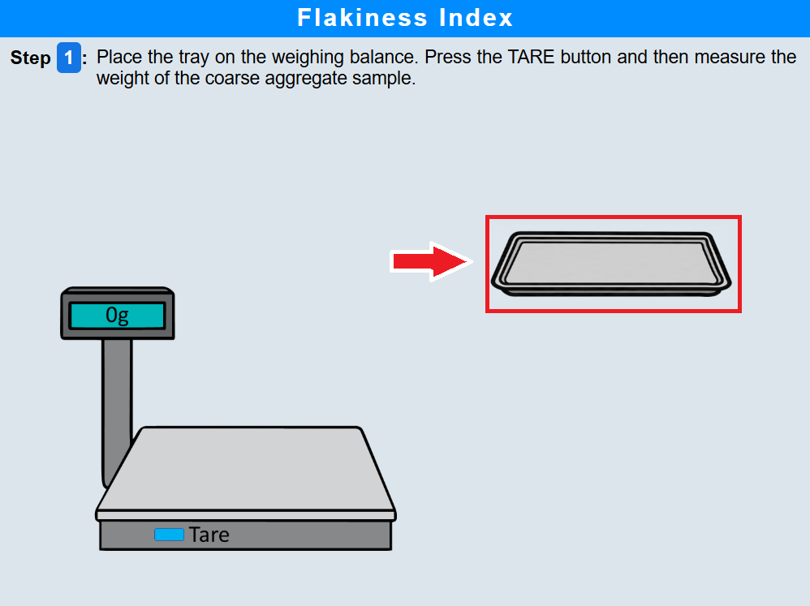 

• Click on the tare button to zero the weighing balance.  
 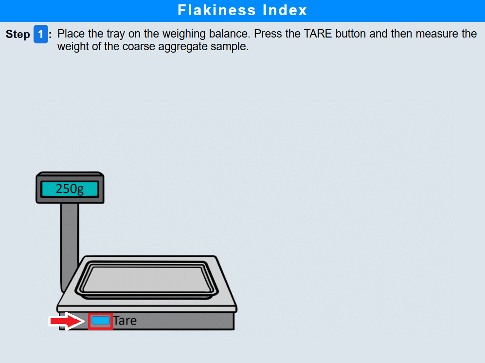 

• Click on the tray again to measure the weight of the coarse aggregate sample.  
 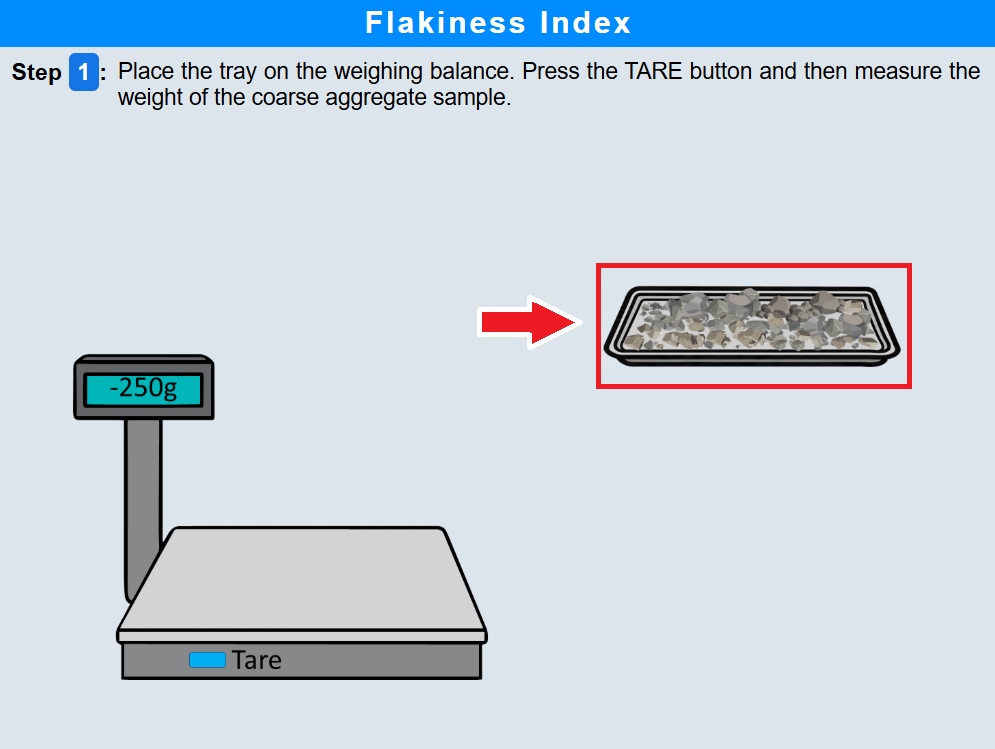 

#### Step 2: Sieve analysis of coarse aggregates

• Click on the assemble button to assemble the sieves in descending order with the largest aperture sieve at the top and the smallest at the bottom. Place a pan at the bottom.  
  

• Click on the aggregate to pour the aggregates into the sieve stack.  
 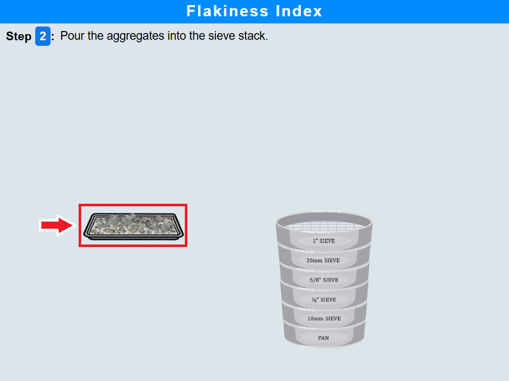 

• Click on the lid to cover the sieve stack.  
  

• Click on the sieve stack to place it on the sieve shaker.  
 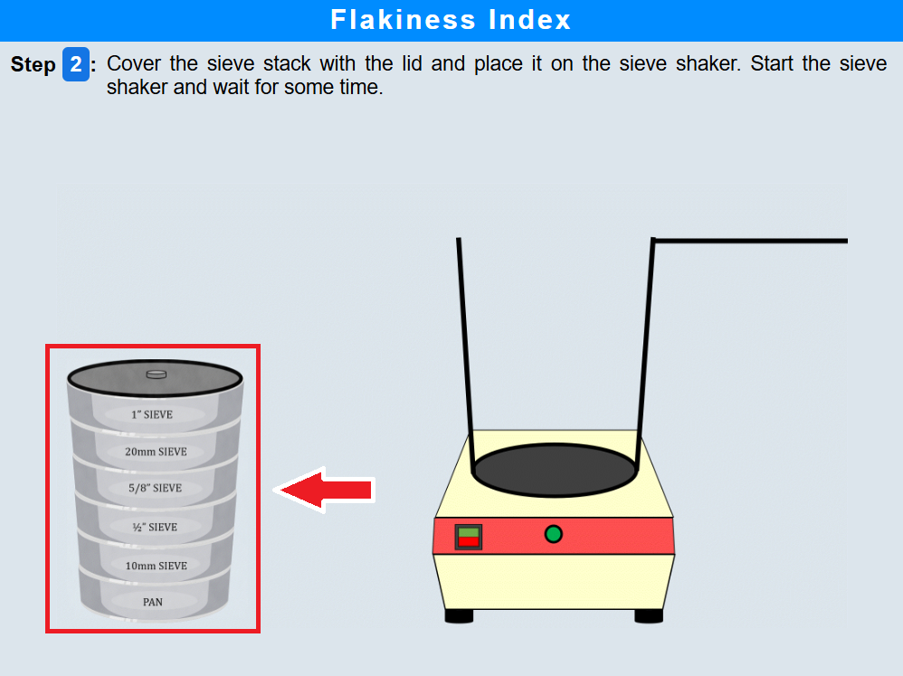 

• Click on the sieve shaker button to start shaking and wait for some time.  
 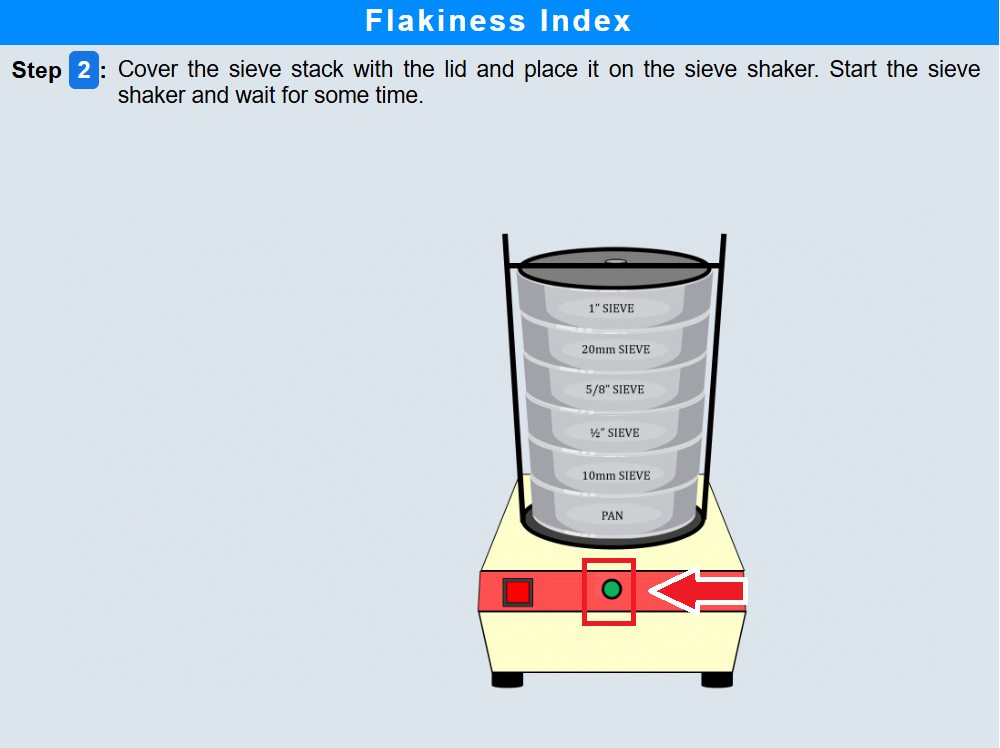 

• Click on the holding rod to secure the sieve stack and remove it from the shaker.  
  

• Click on the sieve stack and note down the aggregates retained on each sieve.  
  

#### Step 3: Flakiness test for 25–20 mm size aggregates

• Click on the aggregates retained on the 20 mm sieve and try passing them one by one through the 25–20 mm slot of the flakiness gauge.  
  

• Separate the aggregates that have passed through the gauge from those that have not passed.  
  

• Click on the tray to weigh the aggregates that passed through the 25–20 mm slot.  
  

#### Step 4: Flakiness test for 20–16 mm size aggregates

• Click on the aggregates retained on the 16 mm sieve and try passing them through the 20–16 mm slot of the flakiness gauge.  
  

• Separate the passing and non-passing aggregates.  
  

• Click on the tray to weigh the aggregates that passed through the 20–16 mm slot.  
  
#### Step 5: Flakiness test for 16–12.5 mm size aggregates

• Click on the aggregates to try passing them through the 16–12.5 mm slot of the flakiness gauge.  
 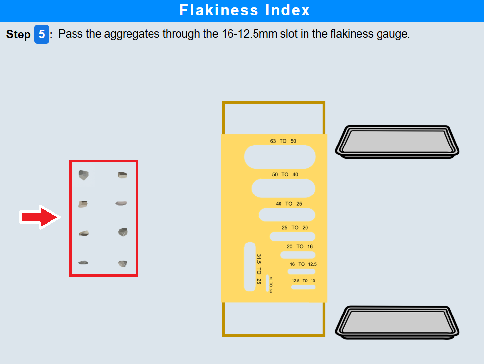 

• Click on the tray to weigh the aggregates that passed through the 16–12.5 mm slot.  
 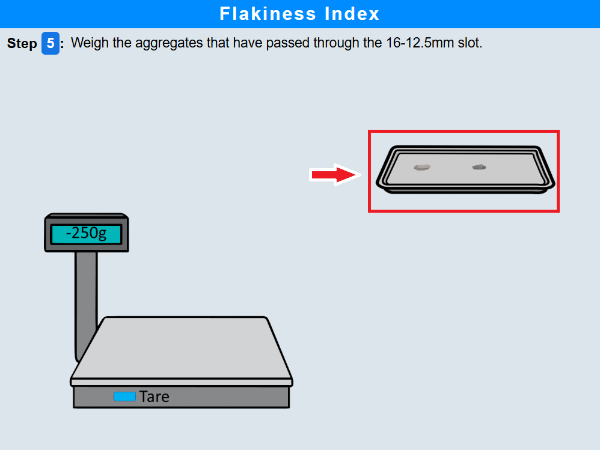 
#### Step 6: Flakiness test for 12.5–10 mm size aggregates

• Click on the aggregates to try passing them through the 12.5–10 mm slot of the flakiness gauge.  
 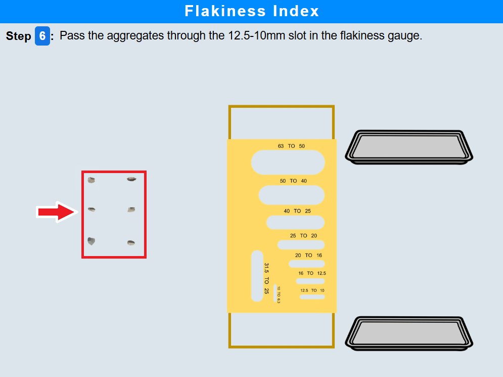 

• Click on the tray to weigh the aggregates that passed through the 12.5–10 mm slot.  
 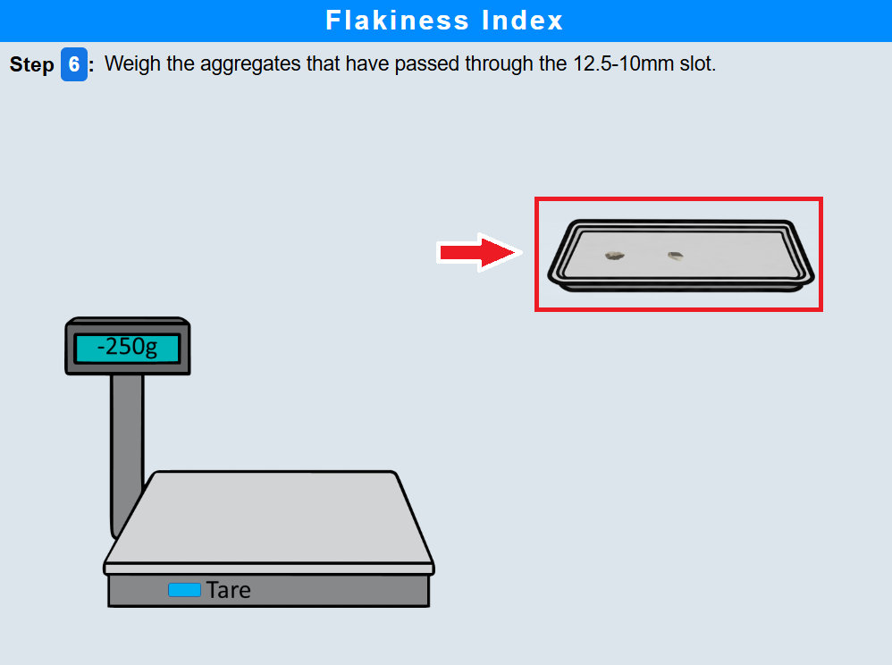 
#### Step 7: Flakiness test for 10–6.3 mm size aggregates

• Click on the flakiness index gauge to rotate it.  
 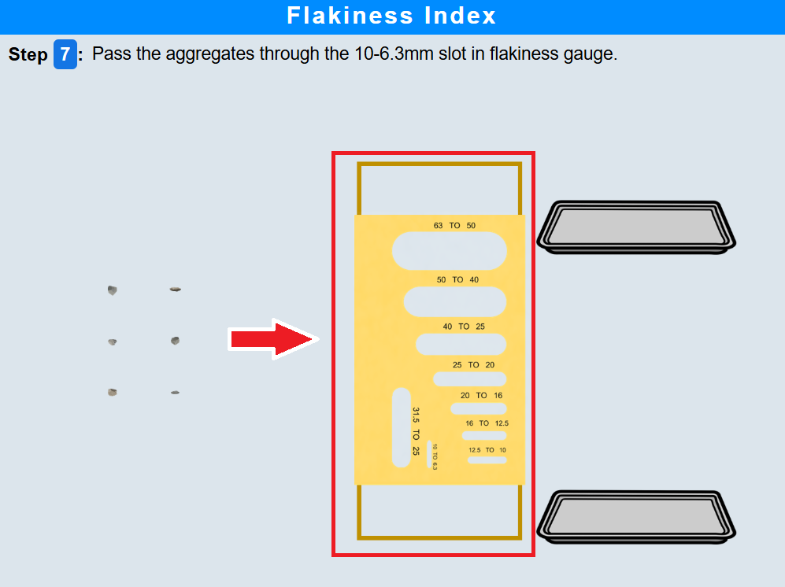 

• Click on the aggregates to try passing them through the 10–6.3 mm slot of the flakiness gauge and collect the passing aggregates.  
 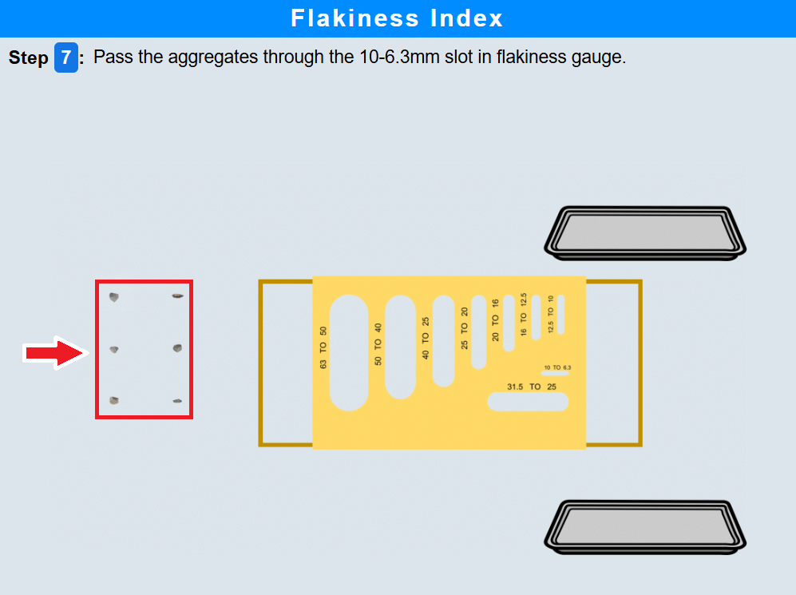 

• Click on the tray to weigh the aggregates passing through the 10–6.3 mm slot.  
  

